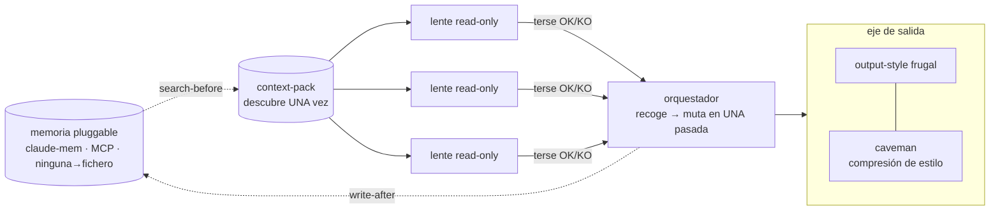

# token-economy

> caveman comprime el ESTILO de salida (siempre activo); token-economy recorta los tokens de ENTRADA/orquestación Y añade disciplina de salida para trabajo multiagente. Complementarios — se suman.

Mecanismos, no consejos. Cada palanca es un fichero que cambia el comportamiento.

## Palancas

| Palanca | Mecanismo | Fichero |
|---|---|---|
| Descubrir una vez | Escanea el repo una sola vez → un `context-pack.md` (target + mapa fichero:línea + `SHARED-FOUND` vacío); cada agente lo lee en vez de re-escanear. Determinista (sin Date.now/random) → estable byte a byte, cacheable. | `scripts/context-pack.mjs` |
| Salida terse de agentes | Plantilla de lente read-only con contrato de salida `OK`/`KO` + una línea por hallazgo; "lee el pack, no re-escanees, no repitas SHARED-FOUND". | `agents/readonly-lens.template.md` |
| Read-only por construcción | Lente con `tools: ["Read","Grep","Glob"]` — sin Edit/Write el read-only queda impuesto, no pedido. Recoge hallazgos y muta en UNA pasada de edición. | `agents/readonly-lens.template.md` |
| Hilo principal frugal | Output-style real de Claude Code: haz el trabajo, lidera con el resultado, un resumen tenso, sin narrar cada paso, sin relleno. El complemento caveman para la salida. Se suma a caveman. | `output-styles/frugal.md` |
| Memoria enchufable | Una interfaz (`search`/`write`), tres backends (claude-mem · otro MCP · ninguno→fichero). search-before / write-after en manos del orquestador = sin carreras entre agentes. Degrada al fichero context-pack. | `references/memory-adapter.md` |
| Cap + caché | Limita el fan-out (anchors + ≤3 hits/fichero, ≤40 ficheros); cachea el pack determinista + memoria para que una 2ª pasada reutilice artefactos. | `scripts/context-pack.mjs` |
| Herramienta, no modelo | El tooling externo determinista (eslint · prettier · rector · ecs · phpstan · ruff · tsc · biome…) se ejecuta como **herramienta con `--fix`** — cero modelo. Un modelo solo para el residual que no auto-arregla, tier más barato; **nunca un modelo de razonamiento delante de un tool con `--fix`**. Bulk mecánico → script temporal bash/python, no editar N ficheros a mano. | *(regla de routing)* |

La skill (`SKILL.md`) une las palancas y apunta cada una a su mecanismo.

## Instalación

```bash
# Como marketplace de plugin (instalable de forma independiente)
/plugin marketplace add davidgarciagordo/token-economy
/plugin install token-economy

# O usa el script suelto (sin deps, Node >= 14)
node scripts/context-pack.mjs <target>      # → .token-economy/context-pack.md
```

## 🚀 Cómo se usa

No corres nada a mano — se enchufa a tu **flujo normal de Claude Code**. Dos pasos de una vez y luego va solo:

```bash
# 1. instala (una vez)
/plugin marketplace add davidgarciagordo/token-economy
/plugin install token-economy

# 2. enciende el lado de salida (una vez) — sesiones terse, resultado primero
/output-style frugal      # viene con el plugin, auto-descubierto al instalar
# apágalo cuando quieras:
/output-style default
```

> Persiste entre sesiones hasta que lo cambies. El estilo `frugal` pone
> `keep-coding-instructions: true`, así que solo cambia el tono — nunca tu capacidad de programar.

**3. Luego trabaja normal.** Cuando le pidas a Claude **trabajo multi-agente** — "revisa los cambios",
"audita esto", "migra X por el repo", lo que sea que abra sub-agentes — el skill se dispara y **Claude
aplica los levers él mismo**: construye un context-pack descubierto-una-vez (corre
`scripts/context-pack.mjs` con su propia Bash tool — *no tú*), despacha los sub-agentes READ-ONLY +
TERSE sobre ese pack, muta en una pasada y usa memoria entre runs. Ves menos tokens y la misma calidad;
nunca tocas los scripts.

> El comando `node scripts/context-pack.mjs …` es lo que **Claude ejecuta por dentro** como parte de la
> orquestación — está documentado por transparencia, no es un paso para ti.

**¿Ya usas `forge-methodology` o `design-review`?** Lo tienes casi gratis — sus agentes de grill / lentes
ya corren read-only + terse sobre un context-pack compartido. token-economy es el hogar suelto de esos
mecanismos + el output-style `frugal`, para cualquier otro trabajo multi-agente.

## Cómo compone



1. Orquestador: `node scripts/context-pack.mjs <target>` una vez → `context-pack.md`.
2. Orquestador: memoria `search`-before → vuelca los hits en `SHARED-FOUND`.
3. Despacha N lentes read-only (contrato terse) — cada una lee el pack, reporta `OK`/`KO`.
4. Orquestador: recoge hallazgos, muta en una pasada, memoria `write`-after.
5. El hilo principal corre con el output-style `frugal` (combínalo con caveman para máxima compresión).

## Benchmark

Medido en esta sesión sobre una pasada real de design-review (Clock Admin, diagnóstico de 4 lentes). Tokens aproximados, comparando un baseline (cada lente re-lee el repo + salida verbosa) contra token-economy (un context-pack + terse + read-only):

| métrica | baseline (re-lectura + verboso) | token-economy (context-pack + terse + read-only) | ahorro |
|---|---|---|---|
| por lente | ~108k | ~42k | ~2.6× |
| diagnóstico completo de 4 lentes | ~430k | ~242k (74k pack único + 4×42k) | ~1.8× |
| 2º diseño, mismo componente | ~671k | ~94k (reúso de artefactos) | ~7× |

**Caveats honestos:** un solo componente; construir el pack cuesta ~74k una vez (se amortiza entre lentes y entre runs); medido sobre la pipeline de design-review en concreto. El mayor ahorro es **entre runs** — el pack determinista + la memoria persistida hacen casi gratis una segunda pasada sobre el mismo target.

## Licencia

MIT © David García Gordo
