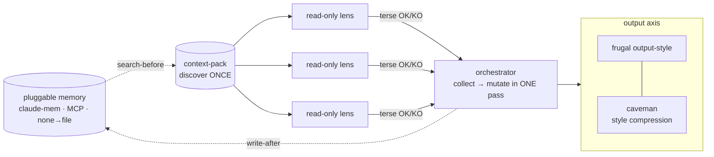

# token-economy

> caveman compresses OUTPUT style (always-on); token-economy cuts INPUT/orchestration tokens AND adds output discipline for multi-agent work. Complementary — they stack.

Mechanisms, not advice. Each lever is a file that changes behavior.

## Levers

| Lever | Mechanism | File |
|---|---|---|
| Discover once | Scan the repo a single time → one `context-pack.md` (target + file:line map + empty `SHARED-FOUND`); every agent reads it instead of re-scanning. Deterministic (no Date.now/random) → byte-stable, cacheable. | `scripts/context-pack.mjs` |
| Terse agent output | Read-only lens template with an `OK`/`KO` + one-line-per-finding output contract; "read the pack, don't re-scan, don't re-report SHARED-FOUND". | `agents/readonly-lens.template.md` |
| Read-only by construction | Lens `tools: ["Read","Grep","Glob"]` — no Edit/Write means read-only is enforced, not requested. Collect findings, then mutate in ONE editing pass. | `agents/readonly-lens.template.md` |
| Frugal main thread | Real Claude Code output-style: do the work, lead with the result, one tight summary, no per-step narration, no filler. The caveman-complement for output. Stacks with caveman. | `output-styles/frugal.md` |
| Pluggable memory | One interface (`search`/`write`), three backends (claude-mem · other MCP · none→file). Orchestrator-owned search-before / write-after = no per-agent races. Degrades to the context-pack file. | `references/memory-adapter.md` |
| Cap + cache | Cap fan-out (anchors + ≤3 hits/file, ≤40 files); cache the deterministic pack + memory so a 2nd pass reuses artifacts. | `scripts/context-pack.mjs` |
| Tool, not a model | Deterministic external tooling (eslint · prettier · rector · ecs · phpstan · ruff · tsc · biome…) runs as a **tool with `--fix`** — zero model. A model only on the residual it can't auto-fix, cheapest tier; **never a reasoning model in front of a `--fix` tool**. Mechanical bulk → a temp bash/python script, not hand-editing N files. | *(routing rule)* |

The skill (`SKILL.md`) ties the levers together and points each to its mechanism.

## Install

```bash
# As a plugin marketplace (independently installable)
/plugin marketplace add davidgarciagordo/token-economy
/plugin install token-economy

# Or use the script standalone (no deps, Node >= 14)
node scripts/context-pack.mjs <target>      # → .token-economy/context-pack.md
```

## 🚀 How to use

It's a toolkit, not a single command — apply the levers in whatever multi-agent work you orchestrate:

1. **Discover once.** Before fanning out agents over a target, build the pack:
   ```bash
   node scripts/context-pack.mjs <target>     # → .token-economy/context-pack.md
   ```
   Pass that file to every sub-agent instead of letting each re-scan the repo.
2. **Make analysis agents read-only + terse.** When you define a lens/reviewer sub-agent, copy
   [`agents/readonly-lens.template.md`](agents/readonly-lens.template.md): `tools: ["Read","Grep","Glob"]`
   (no Edit/Write) + the `OK`/`KO` + one-line-per-finding contract. They report; the orchestrator mutates
   in ONE pass afterwards.
3. **Run the frugal output-style.** Enable [`output-styles/frugal.md`](output-styles/frugal.md)
   (`/output-style frugal`, or copy it into your `~/.claude/output-styles/`) so the main thread leads
   with the result and skips per-step narration. Stacks with [caveman](https://github.com/JuliusBrussee/caveman).
4. **Wire memory (optional).** Follow [`references/memory-adapter.md`](references/memory-adapter.md):
   the orchestrator `search`-before a phase and `write`-after; degrades to the context-pack file if no
   memory tool is present.

**Already using `forge-methodology` or `design-review`?** You get most of this for free — their grill /
lens agents already run as read-only + terse over a shared context-pack. token-economy is the standalone
home of those mechanisms + the `frugal` output-style.

## How it composes



1. Orchestrator: `node scripts/context-pack.mjs <target>` once → `context-pack.md`.
2. Orchestrator: memory `search`-before → fold hits into `SHARED-FOUND`.
3. Dispatch N read-only lenses (terse contract) — each reads the pack, reports `OK`/`KO`.
4. Orchestrator: collect findings, mutate in one pass, memory `write`-after.
5. Main thread runs in the `frugal` output-style throughout (stack with caveman for max compression).

## Benchmark

Measured this session on a real design-review pass (Clock Admin, 4-lens diagnosis). Tokens are approximate, measured comparing a baseline (each lens re-reads the repo + verbose output) against token-economy (one context-pack + terse + read-only):

| metric | baseline (re-read + verbose) | token-economy (context-pack + terse + read-only) | saving |
|---|---|---|---|
| per lens | ~108k | ~42k | ~2.6× |
| full 4-lens diagnosis | ~430k | ~242k (74k one-time pack + 4×42k) | ~1.8× |
| 2nd design, same component | ~671k | ~94k (reuse artifacts) | ~7× |

**Honest caveats:** single component; the pack build is ~74k one-time (it amortizes across lenses and across runs); measured on the design-review pipeline specifically. The biggest win is **cross-run** reuse — the deterministic pack + persisted memory make a second pass on the same target nearly free.

## License

MIT © David García Gordo
